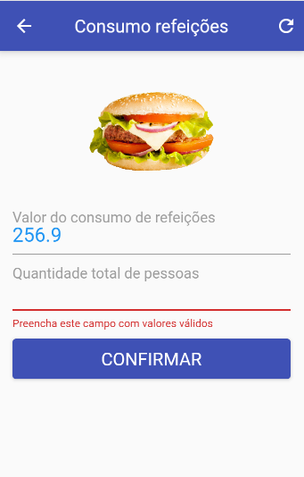
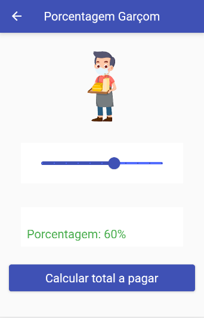

# FlutterApps
  Some projects developed during the discipline of development for mobile devices
  
>   
 
 
 * Racha Conta -> racha_conta_app
 

1. Racha Conta
  A simple app to calculate each customer's bill at a restaurant table

 

## Meta :raising_hand:

Tárcila Fernanda Resende da Silva – [@tarcila414]

:mailbox: &nbsp;  

## Contributing :triangular_flag_on_post:

1. _Fork_ it (<https://github.com/tarcila414/FlutterApps/fork>)
2. Create your feature _branch_ (`git checkout -b feature/fooBar`)
3. _Commit_ your changes (`git commit -am 'Add some fooBar'`)
4. _Push_ to the branch (`git push origin feature/fooBar`)
5. Create a new _Pull Request_